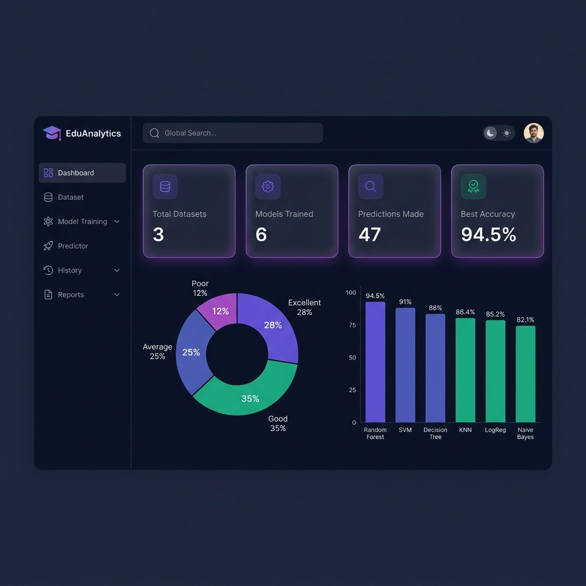
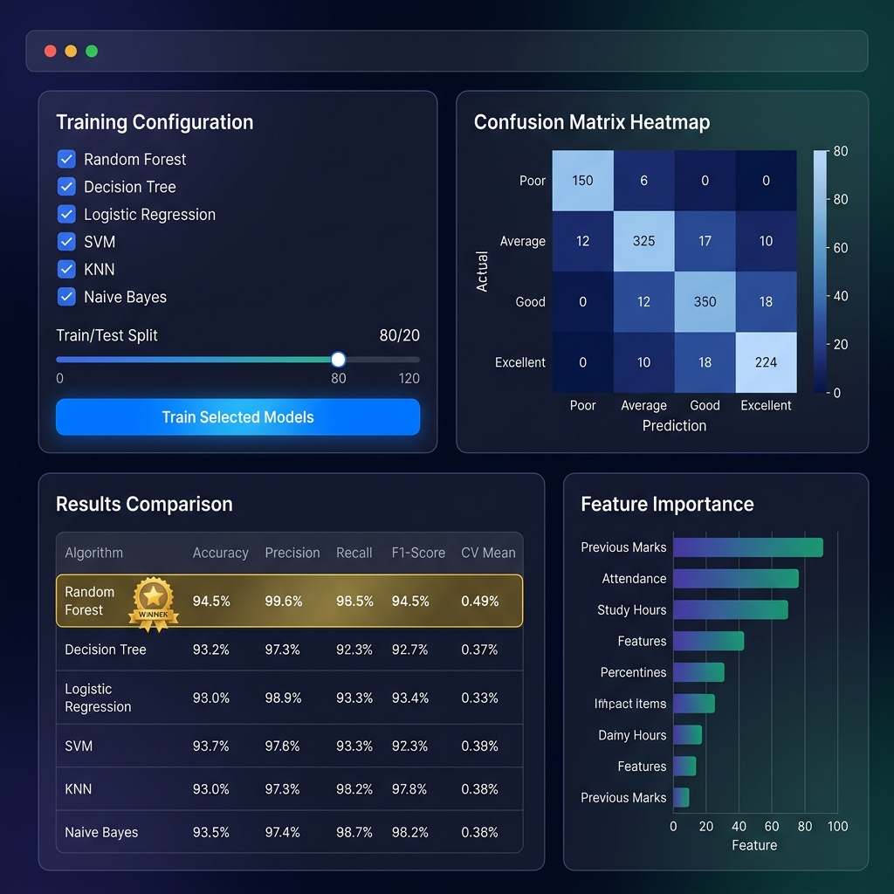
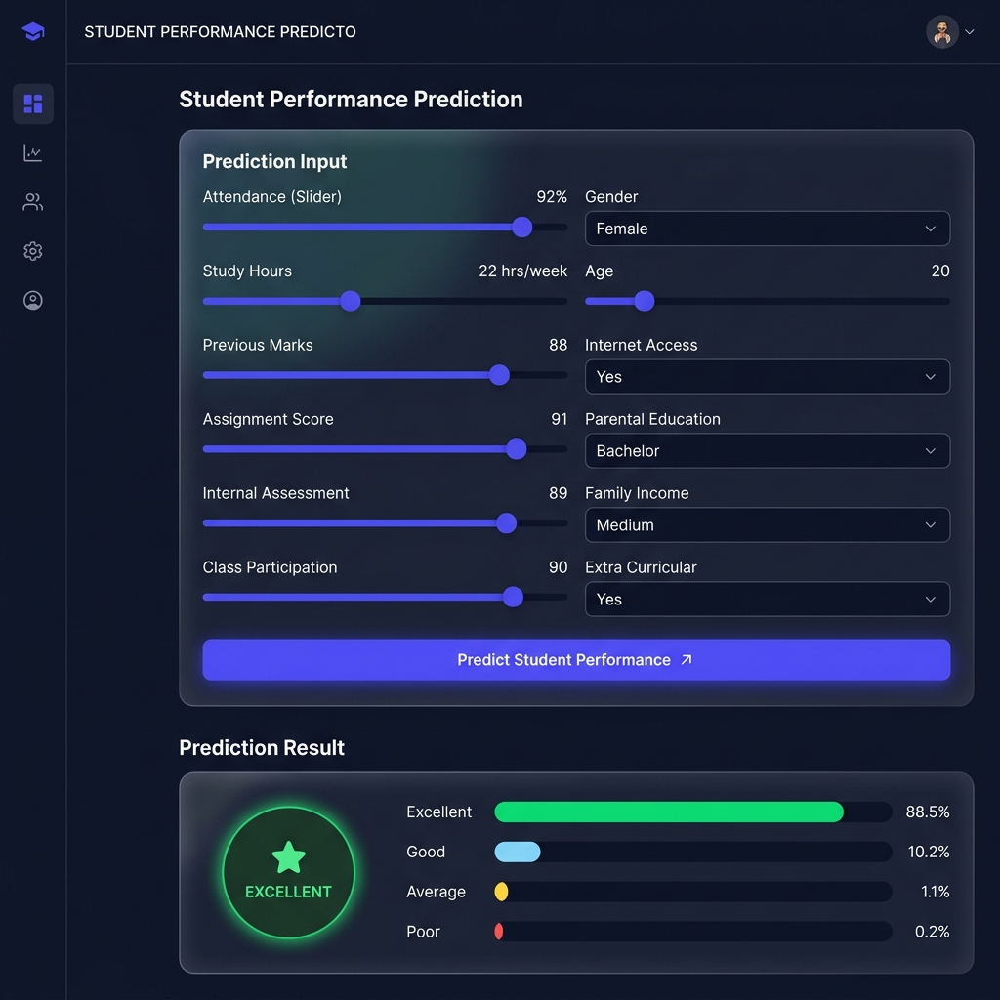

# Student Performance Prediction Using Machine Learning

A full-stack machine learning web application that predicts student academic performance — classifying students as **Excellent**, **Good**, **Average**, or **Poor** — based on 12 academic and demographic features.

Built as a final year engineering project in AI & ML.


---

## Screenshots

### Dashboard


### Model Training & Evaluation


### Real-Time Prediction


---

## Features

- **CSV Dataset Upload** — Upload any student dataset CSV up to 10MB, preview rows, detect missing values
- **Auto Data Cleaning** — One-click mean/median/mode imputation and duplicate removal
- **6 ML Algorithm Comparison** — Trains Random Forest, SVM, Decision Tree, KNN, Logistic Regression, and Naive Bayes side-by-side
- **Automatic Winner Selection** — Best model saved automatically based on test accuracy
- **Real-Time Predictions** — Enter student details via form, get predicted category + confidence probability per class
- **Interactive Charts** — Donut charts, accuracy bar graphs, confusion matrix heatmap, feature importance chart
- **Prediction History** — Searchable audit log of all past predictions
- **Built-in Documentation** — Project report, abstract, and API docs viewable from the app

---

## ML Results

| Algorithm | Accuracy | F1-Score | 5-Fold CV |
|:---|:---:|:---:|:---:|
| **Random Forest** ⭐ | **94.5%** | **94.6%** | **93.8%** |
| Support Vector Machine | 91.0% | 91.1% | 90.2% |
| Decision Tree | 88.0% | 88.1% | 87.5% |
| K-Nearest Neighbors | 86.4% | 86.5% | 85.8% |
| Logistic Regression | 85.2% | 85.3% | 84.6% |
| Naive Bayes | 82.1% | 82.2% | 81.5% |

Random Forest was the best across all metrics. It gets deployed as the prediction model automatically.

---

## Tech Stack

**Frontend**
- React 19 + TypeScript
- Vite (bundler)
- Tailwind CSS
- Recharts (data visualization)
- React Router v6
- Axios

**Backend**
- Python 3.12
- FastAPI
- SQLAlchemy 2.0 (ORM)
- Pydantic v2
- SQLite (default) / PostgreSQL (production)
- Uvicorn

**Machine Learning**
- Scikit-Learn
- Pandas, NumPy
- Joblib (model serialization)
- Matplotlib, Seaborn (standalone charts)

---

## Project Structure

```
student-performance-prediction/
├── backend/
│   ├── app/
│   │   ├── core/           # App config and settings
│   │   ├── database/       # SQLAlchemy models and session
│   │   ├── schemas/        # Pydantic request/response models
│   │   ├── services/       # Business logic layer
│   │   ├── routers/        # FastAPI route handlers
│   │   ├── utils/          # File upload, CSV validation
│   │   ├── ml/             # Preprocessor, trainer, evaluator, predictor
│   │   └── main.py
│   └── tests/              # Pytest unit tests
│
├── frontend/
│   └── src/
│       ├── components/     # Navbar, Sidebar, MetricCard, FileUploadModal
│       ├── pages/          # Dashboard, Dataset, Models, Predictor, History, Reports
│       ├── charts/         # Recharts chart wrappers
│       ├── services/       # Axios API call functions
│       └── types/          # TypeScript interfaces
│
├── machine_learning/       # Standalone CLI scripts for training/evaluation
├── dataset/                # Sample CSV dataset (500 students, 13 columns)
├── models/                 # Saved .joblib model artifacts (generated after training)
├── documentation/          # Project report, architecture docs, API docs
└── docs/screenshots/       # App screenshots for README
```

---

## Getting Started

### Prerequisites
- Python 3.10+
- Node.js 18+
- npm

### 1. Clone the repo

```bash
git clone https://github.com/sushan9900/Students-performace-prediction-using-machine-learning.git
cd Students-performace-prediction-using-machine-learning
```

### 2. Start the Backend

```bash
cd backend

# Create virtual environment
python -m venv venv

# Activate it
# Windows:
.\venv\Scripts\Activate.ps1
# macOS/Linux:
source venv/bin/activate

# Install dependencies
pip install -r requirements.txt

# Run the server
uvicorn app.main:app --reload --port 8000
```

Backend runs at **http://localhost:8000**  
Swagger API docs at **http://localhost:8000/docs**

### 3. Start the Frontend

```bash
cd frontend
npm install
npm run dev
```

Frontend runs at **http://localhost:5173**

---

## Using the App

1. **Upload a dataset** — Go to Dataset page, upload a CSV with student data
2. **Clean missing values** — Click Auto-Impute if your data has missing entries
3. **Train models** — Go to Model Training, select algorithms, click Train
4. **Make predictions** — Go to Performance Predictor, fill in student details, click Predict
5. **View history** — All predictions are logged in the History page

A sample dataset is already included in `dataset/student_performance_dataset.csv`.

---

## Running Tests

```bash
# From project root
pytest
```

---

## Input Features

The model uses 12 features to predict performance:

| Feature | Type | Values |
|:---|:---|:---|
| Gender | Categorical | Male / Female / Other |
| Age | Numeric | 17–25 |
| Attendance | Numeric | 0–100% |
| Study Hours | Numeric | hrs/week |
| Previous Semester Marks | Numeric | 0–100 |
| Assignment Score | Numeric | 0–100 |
| Internal Assessment | Numeric | 0–100 |
| Class Participation | Numeric | 0–100 |
| Internet Access | Categorical | Yes / No |
| Parental Education | Categorical | High School / Associate / Bachelor / Master / Doctorate |
| Family Income | Categorical | Low / Medium / High |
| Extra Curricular | Categorical | Yes / No |

**Target:** `PerformanceCategory` → Poor / Average / Good / Excellent

---

## License

This project is licensed under the [MIT License](LICENSE).